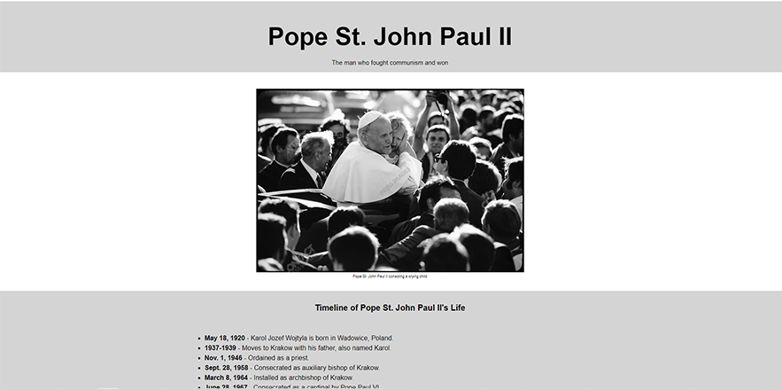

# A Simple Tribute Page
> A Tribute page to one of my favorite humans that ever lived.

This project is part of the freecodecamp certification program.

## Demo
Here's a working live demo of the website: https://julianehiem.github.io/simple-tribute-page/

## Built with

* [HTML](https://developer.mozilla.org/en-US/docs/Web/HTML)
* [CSS](https://developer.mozilla.org/en-US/docs/Web/CSS)

## Links

Here are some links that are useful to better understand this tutorial project:

- Repository: https://github.com/JulianEhiem/simple-tribute-page
- More on Pope St. John Paul II: https://en.wikipedia.org/wiki/Pope_John_Paul_II
 
- Related projects:
  - My Online Portfolio: https://julianehiem.github.io/
 
